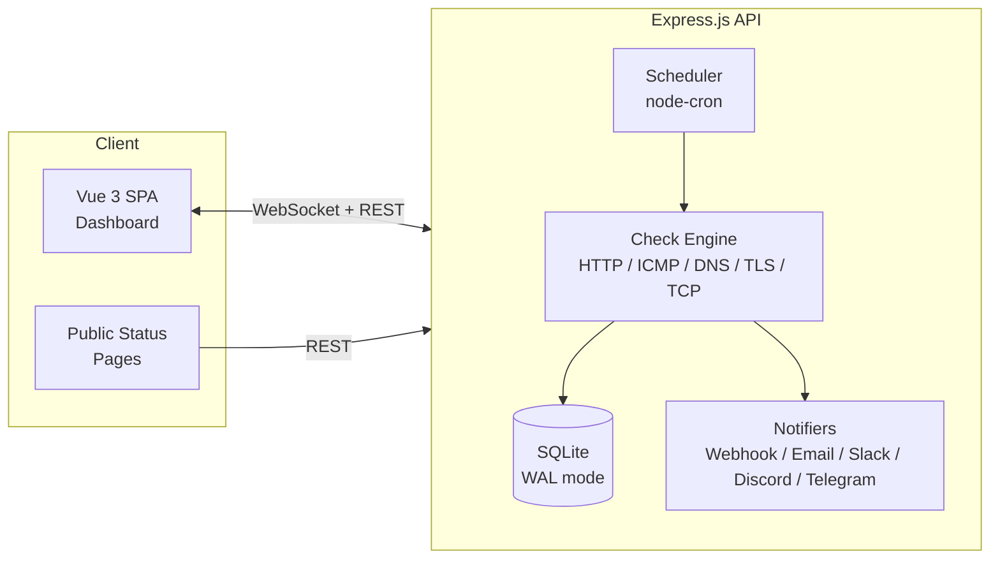

# 🔍 Uptime Detective

A self-hosted uptime monitoring system built with Vue 3 and Express.js. Monitor your services via HTTP, ICMP, DNS, TLS, TCP, and heartbeat checks with real-time dashboards, alerting, and public status pages.


## Features

- **6 Monitor Types** — HTTP(S), ICMP Ping, DNS, TLS/SSL, TCP Port, Heartbeat (push)
- **Real-time Dashboard** — Live status updates via WebSocket (Socket.IO)
- **Response Time Charts** — Chart.js graphs with selectable timeframes (1h, 6h, 24h, 7d, 30d)
- **Incident Tracking** — Auto-created on downtime, auto-resolved on recovery
- **Public Status Pages** — Customizable pages with 90-day uptime bars
- **Notifications** — Webhook, Email (SMTP), Slack, Discord, Telegram
- **Maintenance Windows** — Suppress alerts during planned downtime
- **Dark Mode** — System preference detection + manual toggle
- **REST API** — Token-authenticated CRUD for all resources
- **Docker Ready** — Single container, multi-stage build, hardened security

## Quick Start

### Development

```bash
git clone <repo-url> uptime-detective
cd uptime-detective
npm install
cp .env.example .env
npm run dev
```

Open http://localhost:5173 — the setup wizard will guide you through creating your admin account.

### Docker (Production)

```bash
JWT_SECRET=$(openssl rand -base64 32) docker compose up --build -d
```

Open http://localhost:3300.

## Architecture



## Documentation

| Document | Description |
|----------|-------------|
| [Architecture](docs/architecture.md) | System design, tech stack, check engine flow, status transitions |
| [API Reference](docs/api.md) | Full REST API documentation with examples |
| [Monitors](docs/monitors.md) | Monitor types, configuration, heartbeat usage |
| [Notifications](docs/notifications.md) | Notification channels, triggers, maintenance windows |
| [Configuration](docs/configuration.md) | Environment variables, security settings |
| [Deployment](docs/deployment.md) | Docker, reverse proxy, systemd, backups |
| [Development](docs/development.md) | Local setup, project structure, scripts |
| [Database](docs/database.md) | Schema, migrations, data retention, size estimates |

## License

MIT
