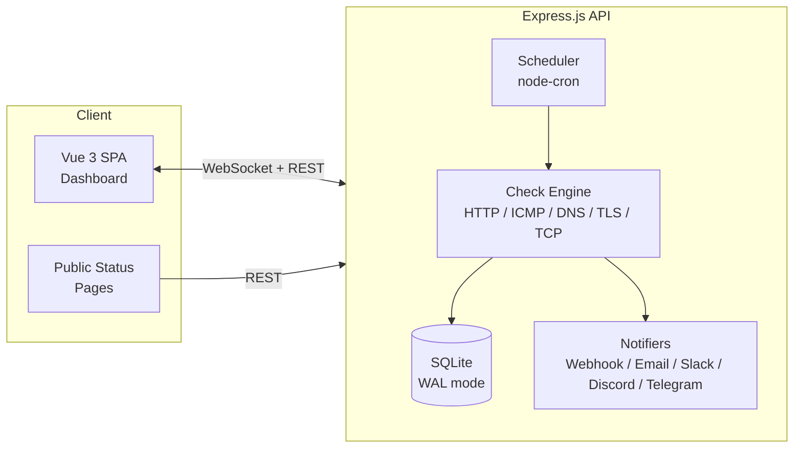
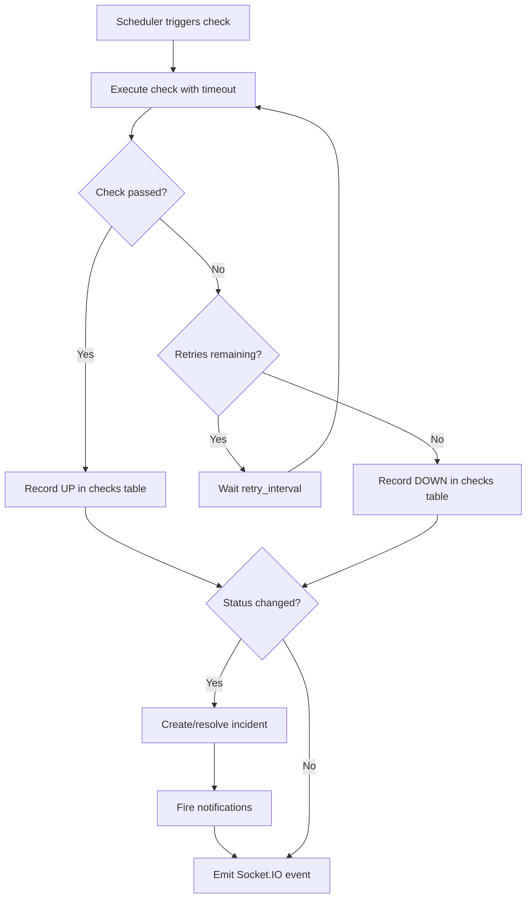

# Architecture

## Overview

Uptime Detective is a monorepo application with three packages:

- **server** — Express.js API with check engine, scheduler, and notification dispatch
- **client** — Vue 3 SPA with real-time dashboard
- **shared** — TypeScript types shared between client and server

All three are managed via npm workspaces from the root `package.json`.

## System Diagram

## Tech Stack

| Layer | Technology |
|-------|-----------|
| Frontend | Vue 3, Vite 6, Pinia, Vue Router, Chart.js, Tailwind CSS |
| Backend | Express.js 4, TypeScript 5.7, Socket.IO 4 |
| Database | SQLite (better-sqlite3, WAL mode) |
| Scheduling | node-cron |
| Auth | JWT + API tokens (bcrypt password hashing) |
| Security | Helmet, express-rate-limit, CORS, CSP headers |
| Notifications | nodemailer (SMTP), native HTTP (webhooks, Slack, Discord, Telegram) |
| Container | Node 22 Alpine, multi-stage build, non-root user |

## Check Engine

The check engine is an in-process scheduler built on node-cron. Each active monitor gets its own cron job based on its configured interval.

### Check Flow

### Status Transitions

| From | To | Action |
|------|----|--------|
| UP | DOWN | Create incident, notify (alert) |
| DOWN | UP | Resolve incident, notify (recovery) |
| UP | DEGRADED | TLS cert expiring within warning threshold |
| Any | MAINTENANCE | During active maintenance window |

Status codes in the database:
- `0` = DOWN
- `1` = UP
- `2` = DEGRADED
- `3` = MAINTENANCE

### Scheduler Internals

- Converts interval (seconds) to cron expression
- Each monitor has an independent job — no shared timer
- Jobs auto-start on server boot for all active monitors
- Creating/updating/deleting monitors dynamically adds/removes jobs
- Graceful shutdown stops all jobs before closing the process

## Real-time Updates

Socket.IO broadcasts events to all connected dashboard clients:

| Event | Payload | When |
|-------|---------|------|
| `check:result` | Check result object | Every check completes |
| `monitor:created` | Monitor object | New monitor created |
| `monitor:updated` | Monitor object | Monitor config changed |
| `monitor:deleted` | `{ monitor_id }` | Monitor deleted |
| `incident:created` | Incident object | New downtime detected |
| `incident:resolved` | Incident object | Downtime resolved |

Clients subscribe on connect and receive all events globally.

## Non-Functional Requirements

| Requirement | Target |
|-------------|--------|
| Max monitors | 500+ (single instance) |
| Check latency overhead | < 50ms per check dispatch |
| Data retention | Configurable (default: 90 days, auto-prune) |
| Dashboard load time | < 1s |
| Database size | ~100MB per 100 monitors at 60s interval for 90 days |
| Deployment | Single `docker-compose.yml` with one container |

## Future Considerations

- **Multi-node deployment** — Redis-backed scheduler for HA
- **Proxy support** — HTTP proxy config for monitors behind firewalls
- **IPv6** — Full support in ICMP and TCP checkers
- **Custom check scripts** — User-defined check logic (security implications)
- **PWA** — Mobile push notifications
- **Internationalization** — i18n for the dashboard
